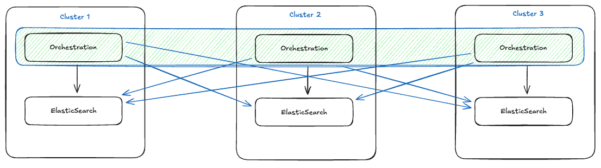

# Multi Region Camunda >=8.8



All prerequisites and theories based on [Camunda Dual Region Setups](https://docs.camunda.io/docs/self-managed/deployment/helm/cloud-providers/amazon/amazon-eks/dual-region/), but we need one cluster and one DNS chain more.

The calculation of the clustersize will change from `x % 2 = 0` to `x % 3 = 0`.

Instead of the `clustersize = 4 || 8` we can use `clustersize = 6 || 9`


## Install Instructions

### Region 1

```shell
helm upgrade --install $CAMUNDA_RELEASE_NAME camunda/camunda-platform \
  --version $HELM_CHART_VERSION \
  --kube-context $CLUSTER_0 \
  --namespace $CAMUNDA_NAMESPACE_0 \
  -f camunda-values.yml \
  -f region0/camunda-values.yml
```

### Region 2

```shell
helm upgrade --install $CAMUNDA_RELEASE_NAME camunda/camunda-platform \
  --version $HELM_CHART_VERSION \
  --kube-context $CLUSTER_1 \
  --namespace $CAMUNDA_NAMESPACE_1 \
  -f camunda-values.yml \
  -f region1/camunda-values.yml
```

### Region 3

```shell
helm upgrade --install $CAMUNDA_RELEASE_NAME camunda/camunda-platform \
  --version $HELM_CHART_VERSION \
  --kube-context $CLUSTER_2 \
  --namespace $CAMUNDA_NAMESPACE_2 \
  -f camunda-values.yml \
  -f region2/camunda-values.yml 
```
